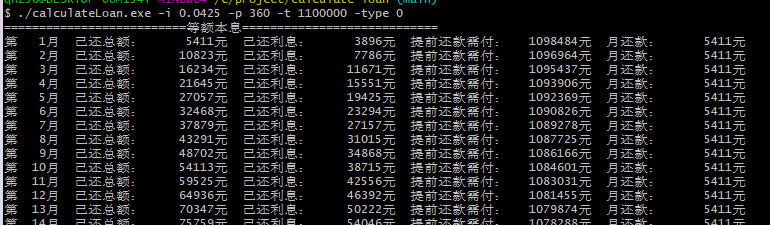

# calculate-loan

通过等额本息与等额本金两种方式计算贷款金额

# how it work

执行`build.sh`，打包出可执行文件`calculateLoan.exe`

然后使用控制台输入

```
calculateLoan.exe -i 0.0425 -p 360 -t 1100000 -type 0
```

计算并打印计数据



# how to use

有三个参数必须设置

- -i 设置年利率，百分比小数，比如：0.0425，就是4.25%
- -p 设置贷款期数，也就是月份，比如：360，就是30年
- -t 贷款总额，想要贷款的金额，单位是元，如果金额是110万，那该值应为：1100000
- -type 程序模式，分为两种，一种是将计算数据打印出来；另一种是将计算数据以csv格式写入文件，可以使用excel打开

参数样例：`-i 0.0425 -p 360 -t 1100000 -type 0`